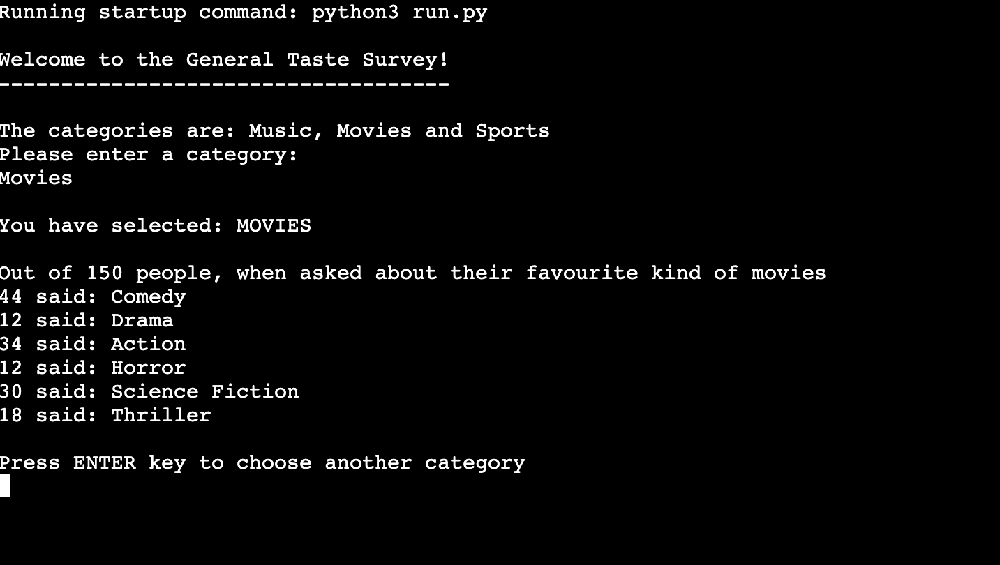
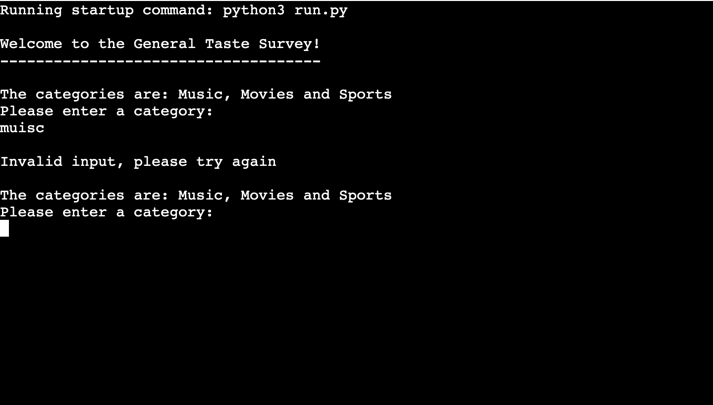

# General Taste Survey

General Taste Survey is a survey about peoples taste in music, movies and sports, based in the Python terminal.
For each category, 150 people have been asked about their favorite genre with 6 different options.

Users can choose a specific category and reveal the survey results.

## **Features**
  - The survey only has two general features.
  - The first feature is a simple menu where the user can choose a category by entering the correct name into the terminal. The survey results will then be displayed.
  - The second feature is a simple option to restart the survey, by pressing the 'enter' key after the results of a category have been displayed.
  

  - An incorrect input (any other input than the exact category name) will trigger a warning.
  

### Testing

- I have confirmed that the survey is fully functional. The category results will only be displayed through a correct input value, and the restart feature works as intended.

- I have passed the code through a PEP8 Python Validator and confirmed there are no problems.

### Unfixed Bugs
No unfixed bugs

## Deployment

- This project was deployed using Code Institue's mock terminal for Heroku. The steps to deploy are as follows:
    - Fork or clone your repository
    - Create a new Heroku app
    - Set the buildbacks to Python and NodeJs in that order
    - Link the Heroku app to the repository
    - Click on Deploy

The live link can be found [here:](https://general-taste-survey.herokuapp.com/)

## Credits

### Content
- The code to connect APIs, as well as the basic structure of the "get_data" functions was taken from Code Institute's "Love Sandwiches" Project
- The code for targeting a specific cell in the Google Sheet was taken from [Bytes](https://bytes.com/topic/python/answers/926844-get-cell-value-google-spreadsheets)